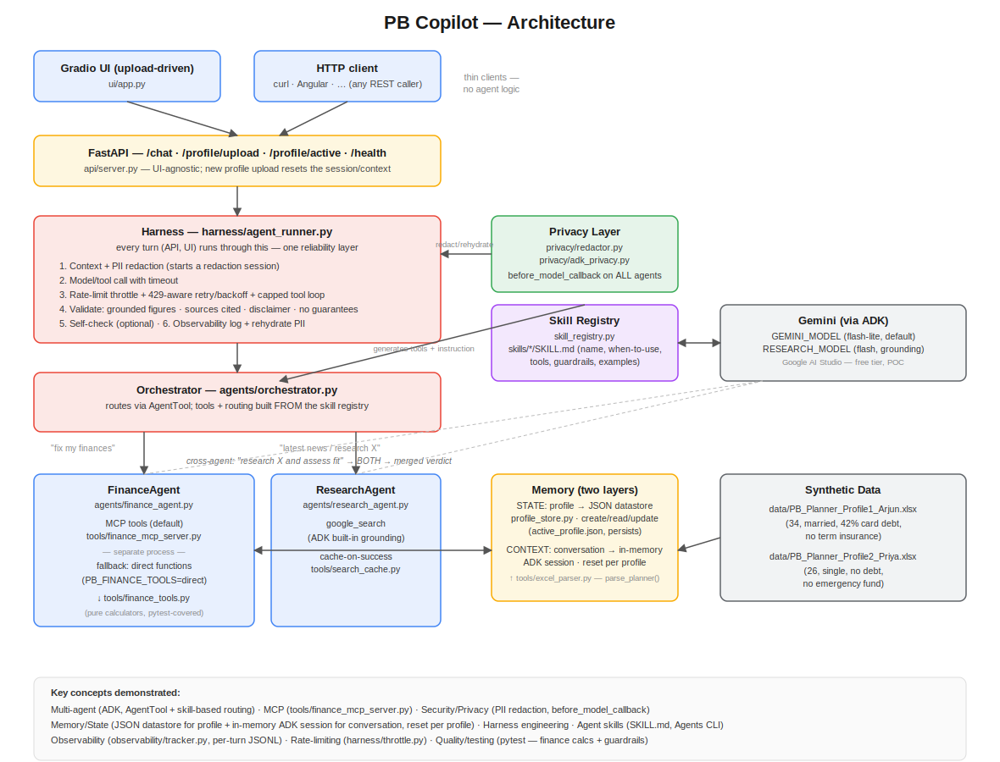

# PB Copilot

A privacy-first personal finance & research assistant, built on Google's Agent
Development Kit (ADK) with Gemini.

## Problem & who it's for

I don't have a financial advisor, and even if I did, I'd still have to do my
own research on funds, stocks, or purchases before acting — usually in a
different tool, disconnected from my actual financial picture. PB Copilot is
built for exactly that gap in my own life: a personal assistant that gives
prioritized, number-backed advice on my emergency fund, insurance, debt, and
goals — and can research something I'm considering, then judge it against my
real situation rather than in the abstract.

## Solution overview

PB Copilot is a **multi-agent system**: an orchestrator routes each query to a
**FinanceAgent** (advisor over the user's own structured profile) and/or a
**ResearchAgent** (live web research via Google Search). The flagship
capability is the **cross-agent flow**: "research this fund and tell me if I
should invest given my situation" makes the orchestrator call *both* agents
and merge their answers into one verdict — the same fund produces different
advice for a user with high-interest debt than for one with a clean balance
sheet, because the finance agent reasons over their actual numbers.

The **differentiator** is a privacy layer: personally identifiable information
(name, account/card number, phone, email) is redacted **before** any data
reaches the model, and re-hydrated only in the final response shown to the
user. See [Privacy & Data Handling](#privacy--data-handling) below for the
exact, honest claim this makes (and does not make).

### Architecture



Both entry points (the Gradio UI and any HTTP client of the FastAPI) drive the
same orchestrator through the same reliability harness — there is no separate
"demo path" that behaves differently from the "real" one.

## Key concepts demonstrated

| Concept | Where it lives | What to look at |
|---|---|---|
| **Multi-agent (ADK)** | [`agents/orchestrator.py`](agents/orchestrator.py), [`agents/finance_agent.py`](agents/finance_agent.py), [`agents/research_agent.py`](agents/research_agent.py) | Orchestrator uses ADK's `AgentTool` (not `sub_agents` transfer) so it stays in control and can call **both** specialists in one turn and merge them. |
| **Agent skills** | [`skills/finance-advisor/SKILL.md`](skills/finance-advisor/SKILL.md), [`skills/research-analyst/SKILL.md`](skills/research-analyst/SKILL.md), [`skill_registry.py`](skill_registry.py) | Routing is **not** hardcoded keywords — the orchestrator's tools *and* its routing instruction are generated from these ADK-native `SKILL.md` declarations. Dropping in a third `skills/<name>/SKILL.md` adds a route with **zero** edits to `orchestrator.py` (see [Extensibility demo](#extensibility-demo-adding-a-third-skill)). |
| **MCP (Model Context Protocol)** | [`tools/finance_mcp_server.py`](tools/finance_mcp_server.py) | FinanceAgent's calculators are served over a local MCP server, running as its own process. A direct in-process fallback (`PB_FINANCE_TOOLS=direct`) exists in case MCP misbehaves — never breaks the working agent. |
| **Security / Privacy** | [`privacy/redactor.py`](privacy/redactor.py), [`privacy/adk_privacy.py`](privacy/adk_privacy.py) | PII is tokenized (`[NAME_1]`, `[EMAIL_1]`, ...) via ADK's `before_model_callback` on every agent, before the real outgoing model request is sent; rehydrated only in the final answer. A redacted-payload debug log proves what actually left the machine. |
| **Memory / State** | [`memory/profile_store.py`](memory/profile_store.py), [`api/server.py`](api/server.py) (`_reset_session`) | **Two layers.** *Persistent state:* the parsed profile is a JSON-file datastore (`data/active_profile.json`, in-memory dict mirrored to disk) supporting create/read/update — survives restarts and is read by the separate MCP process. *Conversation context:* held in memory via ADK's `InMemorySessionService` (the turn history re-sent to the model), scoped to one profile and reset on each new upload so context never bleeds between people. No conversational data touches disk; long-term/vector memory is deferred. |
| **Harness engineering** | [`harness/agent_runner.py`](harness/agent_runner.py) | One reusable wrapper both agents run through: context+redaction → timeout → retry-with-backoff + capped tool loop → output validation (grounded figures, citations, disclaimer, no guaranteed-return language) → optional self-check → logging. |
| **Quality / testing** | [`tests/test_finance_tools.py`](tests/test_finance_tools.py) | `pytest` asserts every calculator reproduces each planner's own spreadsheet-computed figures (not just our own code's expectations), for both profiles, plus the harness guardrails. |
| **Agent CLI / Google tooling** | `agents-cli` | `agents-cli scaffold create` was used once to inspect current ADK project conventions before hand-building this repo's structure. |

## Setup

**Requirements:** Python 3.11+, a free [Google AI Studio](https://aistudio.google.com/apikey) API key.

```bash
# 1. Clone
git clone <this-repo-url> pb-copilot
cd pb-copilot

# 2. Create and activate a virtual environment
python3 -m venv .venv
source .venv/bin/activate          # Windows: .venv\Scripts\activate

# 3. Install exact pinned dependencies
pip install -r requirements.txt

# 4. Configure your own API key — NEVER commit this file
cp .env.example .env
# then open .env and set:
#   GOOGLE_API_KEY=your-own-key-from-https://aistudio.google.com/apikey
```

`.env` is git-ignored; only `.env.example` (no real values) is committed.

### Run it — the Gradio UI (recommended), or the API directly

The workflow is **upload-driven**: you load a profile by uploading its `.xlsx`
planner. Start the API, then the UI:

```bash
# terminal 1 — the API
uvicorn api.server:app --port 8000
# terminal 2 — the Gradio UI (talks to the API above)
python ui/app.py
```
Open the local URL Gradio prints (typically `http://127.0.0.1:7860`), then
**upload** a planner from `data/` (Arjun or Priya) and chat. Uploading a
different planner resets both the chat and the model context.

**Or drive the API directly** (it's UI-agnostic — curl now, Angular later):
```bash
uvicorn api.server:app --port 8000
# upload a planner:
curl -s -X POST http://127.0.0.1:8000/profile/upload \
  -F "file=@data/PB_Planner_Profile1_Arjun.xlsx" | python -m json.tool
# then chat:
curl -s -X POST http://127.0.0.1:8000/chat \
  -H "Content-Type: application/json" \
  -d '{"message":"what should I fix first?"}' | python -m json.tool
```

## Loading a sample profile & example queries

Two synthetic profiles are bundled in `data/` (see [Privacy & Data
Handling](#privacy--data-handling) — no real personal data anywhere):

- **Arjun** — 34, married, home loan + **42% credit-card debt**, no term
  insurance ("fragile family").
- **Priya** — 26, single, no debt but no emergency fund / no insurance
  ("blank slate").

To load a profile: **upload** the Arjun or Priya `.xlsx` from `data/` — in the
Gradio UI via the upload box, or via the API with `POST /profile/upload`.

**Finance queries** (try with both profiles — the advice differs):
```
what should I fix first?
how much should my emergency fund be?
am I under-insured?
how much do I need to retire, and what SIP gets me there?
```

**Research queries** (live Google Search, always cited):
```
Summarize the latest RBI monetary policy decision and what it means for home loan borrowers.
Compare the iPhone 16 and Google Pixel 9 for camera quality and value for money. Which should I buy?
```

**The flagship cross-agent flow** — same query, opposite advice depending on
the loaded profile:
```
(upload Arjun's planner, then ask:)
I'm thinking of starting a SIP in the Parag Parikh Flexi Cap Fund. Research it, and tell me if I should invest given my current financial situation.
```
Expect: ResearchAgent pulls fund facts (cited) → FinanceAgent flags the 42%
card + missing insurance → merged verdict says clear the debt first.
```
(upload Priya's planner, then ask the same query)
```
Expect: same fund research, but the verdict flips — she has no debt and
surplus cash, so it fits her aggressive, long-horizon profile.

### Extensibility demo (adding a third skill)

Routing is generated from `skills/*/SKILL.md`, not hardcoded. To prove it,
drop in a throwaway agent + skill and confirm it routes with **no edit** to
`agents/orchestrator.py`:

```bash
mkdir -p skills/weather-helper
cat > agents/dummy_agent.py <<'PY'
import os
from google.adk.agents import Agent
dummy_agent = Agent(name="dummy_agent", model=os.getenv("GEMINI_MODEL","gemini-flash-lite-latest"),
    description="Dummy weather helper.", instruction="You report the weather.")
PY
cat > skills/weather-helper/SKILL.md <<'MD'
---
name: weather-helper
description: Reports the weather for a city. Demo-only.
metadata:
  agent_ref: "agents.dummy_agent:dummy_agent"
  when_to_use: ["User asks about weather"]
  example_queries: ["What's the weather in Bengaluru?"]
---
# Weather Helper
MD
python -c "from agents.orchestrator import root_agent; print([t.name for t in root_agent.tools])"
# -> ['finance_agent', 'research_agent', 'dummy_agent']

# clean up afterwards
rm -rf skills/weather-helper agents/dummy_agent.py
```

## Testing

```bash
python -m pytest tests/ -v
```

Asserts the finance calculators reproduce **each planner's own
spreadsheet-computed figures** (retirement corpus & SIP, HLV insurance gap,
goal SIP, debt-avalanche order, emergency-fund months) for both Arjun and
Priya — including Priya's edge cases (empty debts, zero insurance) with no
crashes — plus the harness guardrails (guaranteed-return language, missing
disclaimer, ungrounded figures are all caught).

## Privacy & Data Handling

This is the project's differentiator. The claims below are the **only**
privacy claims made anywhere in this project:

> Financial figures are processed by the Gemini model to generate advice;
> personally identifiable information is redacted before the model call. This
> POC uses the free Google AI Studio tier with synthetic data only. For real
> personal use, a no-training tier (paid Gemini API or Vertex AI) is required,
> as the free tier may use data to improve products.

Concretely:
- PII (name, account number, card number, phone, email) is **redacted
  locally** before any model call, and re-hydrated only in the final
  user-facing response ([`privacy/redactor.py`](privacy/redactor.py),
  [`privacy/adk_privacy.py`](privacy/adk_privacy.py)).
- The demo and repo use **synthetic data only** — no real personal or
  financial data anywhere.
- All data except the single redacted model call stays on the user's machine
  (local JSON profile store, local MCP server).
- We do **not** claim "no LLM ever sees your data" — that would be false. The
  model must read financial figures to give advice; only PII is redacted.

To verify redaction yourself, start the API with
`PB_DEBUG_REDACTION=1 uvicorn api.server:app --port 8000`, send a chat request,
and inspect `logs/outgoing_model_payload.log` — it contains tokens (`[NAME_1]`),
never raw PII, while financial figures remain real numbers.

## Security features

- `.env` holds the only secret (the API key); it is git-ignored and nothing
  sensitive is hardcoded in source.
- Input validation on profile fields (numbers are validated non-negative;
  malformed Excel input raises a clear error rather than reaching the model).
- FinanceAgent/ResearchAgent guardrails (enforced by the harness): no
  guaranteed-return claims; the educational disclaimer is mandatory on every
  financial/investment answer.
- No raw PII is ever written to logs — the debug payload log is captured
  **after** redaction.

## Educational disclaimer

**PB Copilot provides educational guidance only — it is not licensed
financial advice.** Every finance and investment answer produced by the
system ends with this note; treat it as a starting point for your own
research and decisions, not a substitute for a licensed financial advisor.

## Project structure

```
pb-copilot/
├── agents/            orchestrator.py, finance_agent.py, research_agent.py
├── tools/             finance_tools.py (pure calculators), excel_parser.py,
│                      finance_mcp_server.py, search_cache.py
├── harness/           agent_runner.py (six-layer reliability wrapper),
│                      throttle.py (client-side rate limiter)
├── observability/     tracker.py — structured per-turn logging + console setup
├── privacy/           redactor.py, adk_privacy.py
├── memory/            profile_store.py — JSON-persisted active profile
├── skills/            finance-advisor/SKILL.md, research-analyst/SKILL.md
├── skill_registry.py  turns SKILL.md files into routing artifacts
├── data/              PB_Planner_Profile1_Arjun.xlsx, ...Profile2_Priya.xlsx
├── tests/             test_finance_tools.py
├── api/               server.py — FastAPI /chat, /profile/upload, /profile/active, /health
├── ui/                app.py — Gradio UI (HTTP client of api/server.py)
├── docs/              architecture.svg
├── requirements.txt   pinned dependencies
└── .env.example       template — copy to .env, add your own key
```

## Notable design decisions

- **Model choice:** the plan originally specified Gemini 2.0 Flash, but it has
  since been **shut down** (confirmed against current Gemini docs at build
  time). `GEMINI_MODEL` defaults to `gemini-flash-lite-latest` (a
  larger free-tier quota, on its own quota bucket) and `RESEARCH_MODEL`
  defaults to `gemini-flash-latest` (grounding-capable, and a separate quota
  bucket from the lite model) — both are `.env` variables, not hardcoded, so
  they can be repinned without touching code.
- **AgentTool over `sub_agents` transfer:** the orchestrator needed to call
  *two* specialists in one turn and merge their output (the cross-agent flow).
  ADK's `sub_agents` delegation permanently hands off control to one agent;
  `AgentTool` keeps the orchestrator in control, which is what makes the merge
  possible without a later rewrite.
- **Skill-based routing:** rather than hand-write per-agent routing rules, the
  orchestrator's instruction and tool list are *generated* from
  `skills/*/SKILL.md` — the same file that documents each specialist's
  purpose, triggers, tools, guardrails and examples for a human reader. One
  source of truth for both.
- **MCP with a fallback:** `google_search` is model-internal grounding, not a
  regular function tool — mixing it with function tools disables automatic
  function calling. This is part of why FinanceAgent's calculators (function
  tools) and ResearchAgent's search live on separate agents, merged by the
  orchestrator, rather than combined into one agent.
- **Harness validation is number-grounded, not vibes:** rather than trusting
  the model's self-report, the harness recomputes every figure the finance
  tools *could* legitimately produce and checks the model's stated numbers
  against that set — an invented figure is caught deterministically, for
  free, without an extra model call.
